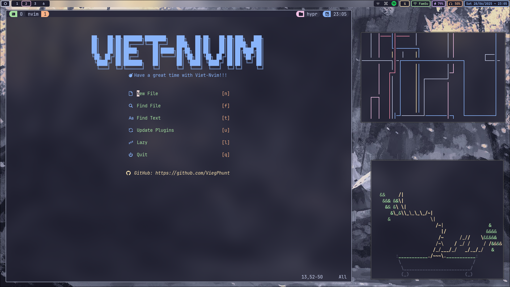

# My Arch-Hyprland Install Script
This script automates the installation and setup of my Arch Hyprland environment.

## Table of Contents
- [My Arch-Hyprland Install Script](#my-arch-hyprland-install-script)
  - [Table of Contents](#table-of-contents)
  - [Preview](#preview)
    - [Videos](#videos)
    - [Screenshots](#screenshots)
  - [Important Notes](#important-notes)
  - [Installation](#installation)

## Preview
### Videos
[▶️ Watch on YouTube](https://www.youtube.com/watch?v=R4udSxtli8g)

### Screenshots
<p align="center">
    
    
    
    
    
    
</p>

## Important Notes
> [!IMPORTANT]
> `This script automates the installation and setup of my Arch Hyprland environment.`
> - If you want to try it, you should use a minimal profile and backup your system beforehand.

> [!NOTE]
> This script does not include package uninstallation, as some packages may already exist on your system by default. Creating an uninstallation script could potentially affect your current setup.

> [!NOTE]
> This is my dotfiles repo: [`Dotfiles`](https://github.com/ViegPhunt/Dotfiles).

## Installation
Use this script to install Hyprland on an Arch-based system:
```
git clone --depth=1 https://github.com/ViegPhunt/Arch-Hyprland.git
cd ~/Arch-Hyprland
chmod +x install.sh
./install.sh
```
